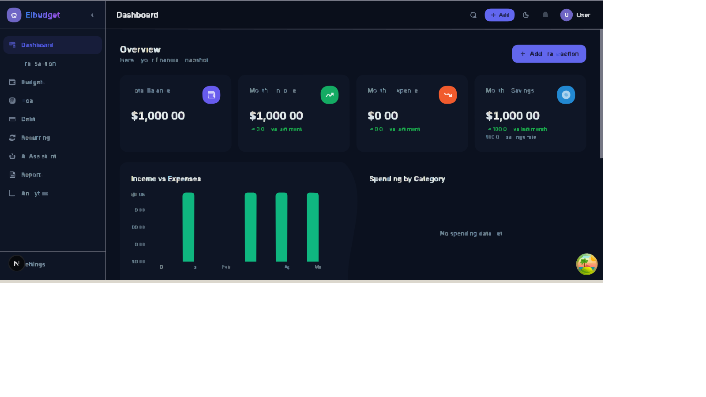
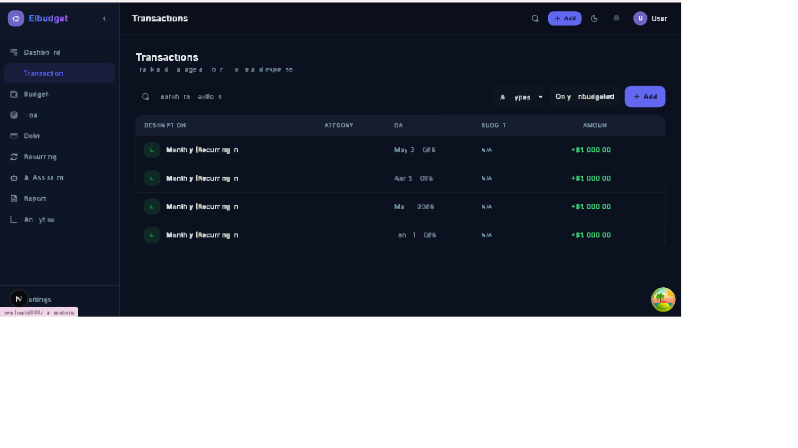
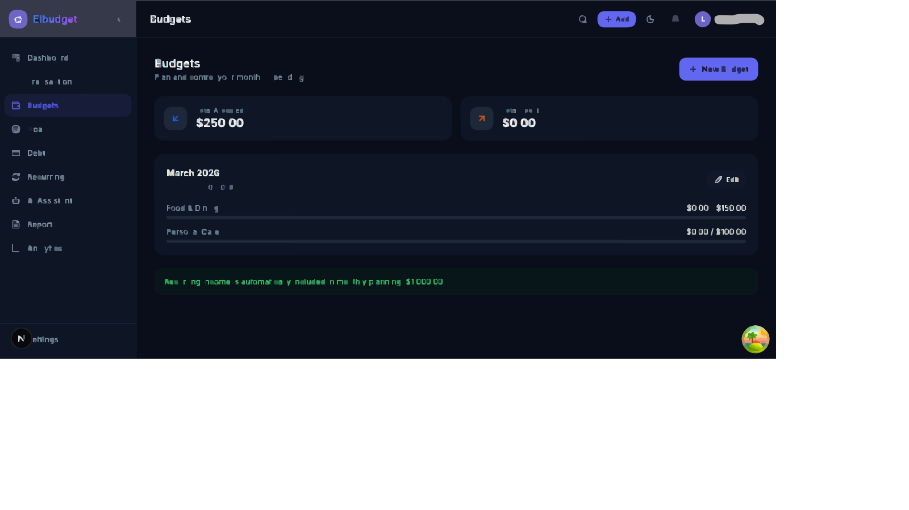
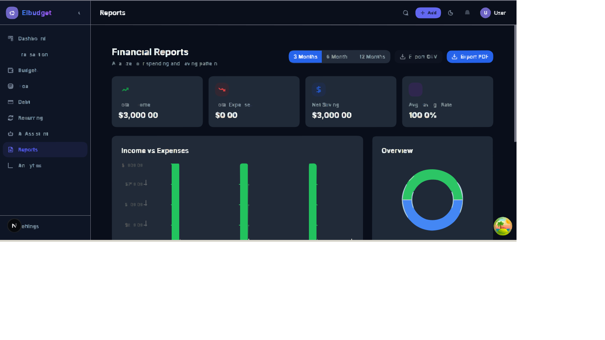
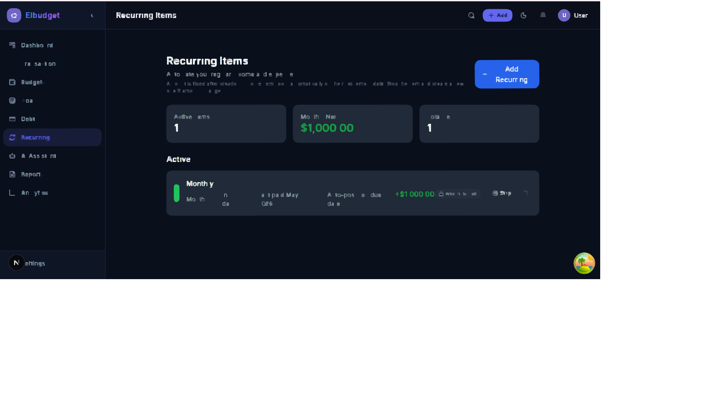

# Elbudget

Elbudget is an AI-powered personal finance and budgeting web application built with Next.js.
It helps users track income and expenses, manage category budgets, monitor goals and debt, handle recurring items, and generate reports and insights.

## Screenshots







When replacing placeholders with real screenshots, use PNG at 1600x900 for visual consistency.
Use `npm run screenshots:check` before committing.
See `docs/screenshots/CHECKLIST.md` for capture standards.

## Features

- Authentication and onboarding flow
- Dashboard with financial overview widgets
- Income and expense tracking
- Budget creation and category allocation
- Budgeted vs unbudgeted transaction visibility
- Goals and savings challenge tracking
- Debt tracking
- Recurring transaction management
- Auto-sync for due recurring income
- AI insights endpoint and dashboard widget
- Reports with CSV and PDF export
- User settings and profile preferences

## Tech Stack

- Framework: Next.js 15 (App Router), React 19, TypeScript
- Styling/UI: Tailwind CSS, Radix UI, Framer Motion
- Data: Prisma ORM (SQLite for local development, PostgreSQL-ready schema for production)
- Auth: NextAuth
- State/Data fetching: Zustand, TanStack React Query
- Validation: Zod + React Hook Form
- Charts/Reporting: Recharts, jsPDF, jspdf-autotable
- Testing: Jest, Playwright (scripts configured)

## Local Setup

### 1. Prerequisites

- Node.js 20+
- npm 10+

### 2. Install dependencies

```bash
npm install
```

### 3. Configure environment variables

Copy the sample env file:

```bash
cp .env.example .env.local
```

On Windows PowerShell:

```powershell
Copy-Item .env.example .env.local
```

Then fill in values in `.env.local`.

### 4. Initialize database

For local SQLite development:

```bash
npm run db:generate
npm run db:push
```

Optional seed data:

```bash
npm run db:seed
```

### 5. Start development server

```bash
npm run dev
```

Open http://localhost:3000

## Environment Variables

Defined in `.env.example`:

### App and Auth

- `NEXTAUTH_URL`
- `NEXTAUTH_SECRET`

### Database

- `DATABASE_URL` (default local SQLite: `file:./dev.db`)
- For production, use PostgreSQL values from `.env.production.example`

### OAuth

- `GOOGLE_CLIENT_ID`
- `GOOGLE_CLIENT_SECRET`

### AI

- `OPENAI_API_KEY`

### Email / SMTP

- `EMAIL_SERVER_HOST`
- `EMAIL_SERVER_PORT`
- `EMAIL_SERVER_USER`
- `EMAIL_SERVER_PASSWORD`
- `EMAIL_FROM`

### Stripe

- `STRIPE_SECRET_KEY`
- `STRIPE_PUBLISHABLE_KEY`
- `STRIPE_WEBHOOK_SECRET`
- `NEXT_PUBLIC_STRIPE_PUBLISHABLE_KEY`

### App Public Config

- `NEXT_PUBLIC_APP_URL`
- `NEXT_PUBLIC_APP_NAME`

### Scheduled Jobs

- `CRON_SECRET` (used to protect cron endpoint)

### Rate Limiting / Infra

- `UPSTASH_REDIS_REST_URL`
- `UPSTASH_REDIS_REST_TOKEN`

## Database Setup

Prisma uses SQLite for local development in this repository.

- Schema file: `prisma/schema.prisma`
- Datasource: SQLite via `DATABASE_URL`
- Production schema file: `prisma/schema.postgresql.prisma`

Common commands:

```bash
npm run db:generate   # Generate Prisma client
npm run db:push       # Push schema to database
npm run db:migrate    # Create/apply dev migration
npm run db:studio     # Open Prisma Studio
npm run db:generate:pg # Generate Prisma client from PostgreSQL schema
npm run db:migrate:pg  # Create PostgreSQL migrations in development
npm run db:deploy:pg   # Apply PostgreSQL migrations in deployment
```

Production migration recommendation:

1. Keep local development on SQLite for fast setup.
2. Run and validate PostgreSQL migrations using `prisma/schema.postgresql.prisma`.
3. Deploy with PostgreSQL `DATABASE_URL` from `.env.production.example`.

## Testing

Available scripts:

```bash
npm run test
npm run test:e2e
npm run lint
npm run type-check
```

Notes:

- Jest and Playwright scripts are present in `package.json`.
- If no tests are currently committed, these commands may pass with no test coverage or require additional test setup files depending on your local state.

## Deployment Notes

### Vercel

This project includes `vercel.json` cron configuration:

- Path: `/api/cron/recurring-income`
- Schedule: `0 5 * * *` (daily at 05:00 UTC)

For production deployment:

- Set all required environment variables in your hosting platform.
- Do not commit local artifacts like `prisma/dev.db` or install logs.
- Ensure `CRON_SECRET` is configured and matches the cron caller authorization.
- Configure `NEXTAUTH_URL` and `NEXTAUTH_SECRET` for production domain/security.
- Run `npm run build` to verify production build before deploy.

## API Architecture

The API now includes shared server-side helpers and service modules:

- Response and error envelope helpers in `lib/server/api.ts`
- Auth and ownership helpers in `lib/server/auth.ts`
- Zod request validation helper in `lib/server/validation.ts`
- Route-level rate limiting helper in `lib/server/rate-limit.ts`
- Domain service modules in `lib/services/*`

Current route adoption examples:

- `app/api/auth/register/route.ts` uses standardized validation, response envelopes, and rate limiting
- `app/api/ai/chat/route.ts` uses auth enforcement, rate limiting, and AI domain service orchestration

## Security Hardening

Security controls implemented for finance-grade trust:

- Credential auth with bcrypt and OAuth support
- Brute-force protection via route and key-based rate limiting
- Secure password reset flow:
  - hashed reset tokens at rest
  - one-time-use token invalidation
  - expiry enforcement
- Two-factor authentication (TOTP) flow:
  - setup QR + manual secret key
  - verify enable
  - secure disable with code challenge
- Security audit trail for key auth and AI events
- Security activity endpoint for session/device visibility patterns

Key security endpoints:

- `app/api/auth/forgot-password/route.ts`
- `app/api/auth/reset-password/route.ts`
- `app/api/auth/2fa/setup/route.ts`
- `app/api/auth/2fa/verify/route.ts`
- `app/api/auth/2fa/disable/route.ts`
- `app/api/user/sessions/route.ts`

## AI Safety And Cost Controls

The AI stack includes guardrails for safer and more predictable behavior:

- Plan-based AI quotas (free vs premium)
- Request rate limiting on AI routes
- Prompt boundaries that avoid overconfident professional advice
- Required educational disclaimer in AI responses
- Deterministic fallback summary when AI is unavailable
- Confidence signal in assistant responses
- Prompt/response metadata logging for debugging and cost tracking:
  - model
  - token usage
  - latency
  - prompt/response sizes
- Conversation context window limiting to reduce token costs

AI endpoints and modules:

- `app/api/ai/chat/route.ts`
- `app/api/ai/insights/route.ts`
- `lib/ai.ts`
- `lib/services/ai.service.ts`

## Premium Plan Consistency

Current capabilities are defined centrally in `types/index.ts` and enforced in API routes.

Free plan limits:

- Budgets: 3
- Goals: 3
- Active debts: 5
- AI assistant responses: 30 per month
- AI insight generations: 3 per month
- Report history depth: up to 6 months
- Export formats: CSV

Premium plan capabilities:

- Unlimited budgets/goals/debts
- Unlimited AI usage
- Report history up to 12 months
- Export formats: CSV, PDF, XLSX

Route-level gating examples:

- Budget creation limit: `app/api/budgets/route.ts`
- Goal creation limit: `app/api/goals/route.ts`
- Debt creation limit: `app/api/debts/route.ts`
- AI quotas: `app/api/ai/chat/route.ts`, `app/api/ai/insights/route.ts`
- Report depth gating: `app/api/reports/route.ts`

Billing lifecycle and reconciliation:

- Stripe webhook handler updates subscription lifecycle states:
  - trialing
  - active
  - cancellation
  - payment failure (past due)
  - payment recovery
- Webhook endpoint: `app/api/billing/webhook/route.ts`

## Testing Strategy

Test suites are organized by layer:

- Unit tests: financial calculations, formatting, validation schemas, debt payoff math
- Integration tests: auth registration route behavior and subscription capability consistency
- E2E suite scaffold: core user journey routes (registration/login/onboarding/dashboard feature pages)

Commands:

```bash
npm test
npm run test:unit
npm run test:integration
npm run test:e2e
npm run test:e2e:full
```

Note: full E2E runs are gated behind `RUN_E2E=true` for stability in local/CI contexts.

## CI/CD

GitHub Actions CI runs on every push and pull request with:

1. `npm ci`
2. `npm run type-check`
3. `npm run lint`
4. `npm test`
5. `npm run build`

Workflow file:

- `.github/workflows/ci.yml`

## Roadmap

- Add repository screenshots and a short product tour GIF
- Add automated unit/integration test coverage for API routes and critical UI flows
- Add Playwright E2E coverage for onboarding, budgets, transactions, recurring, and reports
- Add CI pipeline (lint, type-check, tests, build)
- Add API docs for core endpoints
- Add contribution guidelines and code style conventions
- Improve observability and error tracking for production

## Contributing

Contributions are welcome.

Please start with the contribution guide in `CONTRIBUTING.md`.

A good first contribution is to:

1. Add screenshots to the `docs/screenshots` folder
2. Add tests for one feature module
3. Improve docs for deployment and operations

## License

This project is licensed under the MIT License.
See `LICENSE` for details.
